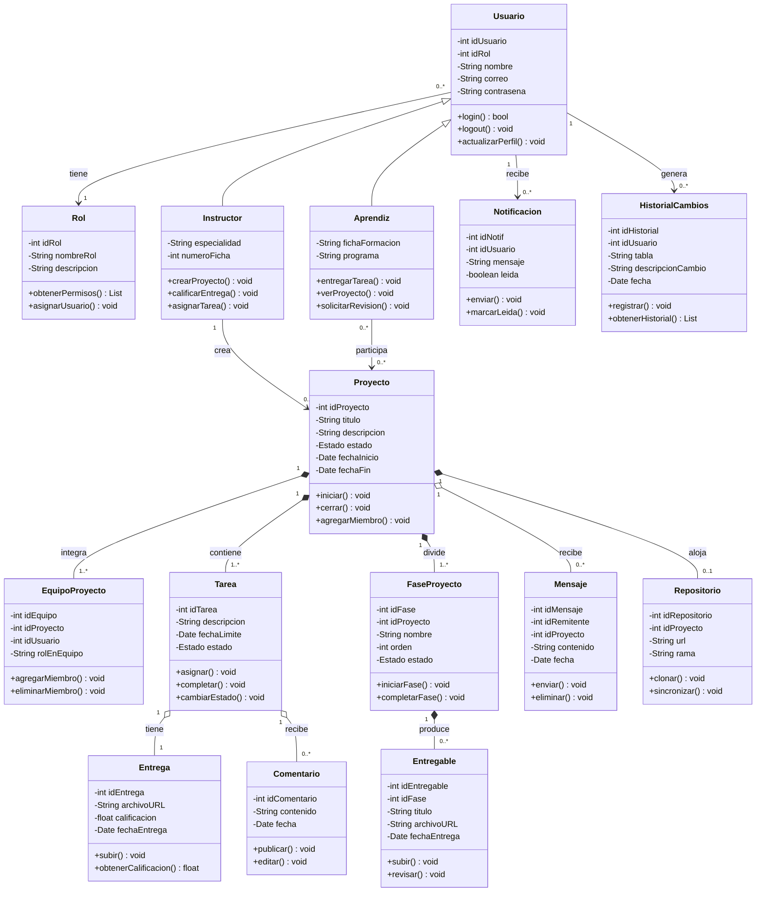

## 1. Descripción general

Este diagrama representa la estructura de clases del sistema de gestión de proyectos SENA. Incluye herencia, composición, agregación y asociación entre las entidades principales del dominio.

---

## 2. Clases del sistema

### 2.1 `Usuario` *(clase base)*

| Visibilidad | Atributo / Método | Tipo |
|:-----------:|-------------------|------|
| `-` | `idUsuario` | `int` |
| `-` | `idRol` | `int` |
| `-` | `nombre` | `String` |
| `-` | `correo` | `String` |
| `-` | `contrasena` | `String` |
| `+` | `login()` | `bool` |
| `+` | `logout()` | `void` |
| `+` | `actualizarPerfil()` | `void` |

---

### 2.2 `Aprendiz` *(hereda de `Usuario`)*

| Visibilidad | Atributo / Método | Tipo |
|:-----------:|-------------------|------|
| `-` | `fichaFormacion` | `String` |
| `-` | `programa` | `String` |
| `+` | `entregarTarea()` | `void` |
| `+` | `verProyecto()` | `void` |
| `+` | `solicitarRevision()` | `void` |

---

### 2.3 `Instructor` *(hereda de `Usuario`)*

| Visibilidad | Atributo / Método | Tipo |
|:-----------:|-------------------|------|
| `-` | `especialidad` | `String` |
| `-` | `numeroFicha` | `int` |
| `+` | `crearProyecto()` | `void` |
| `+` | `calificarEntrega()` | `void` |
| `+` | `asignarTarea()` | `void` |

---

### 2.4 `Proyecto`

| Visibilidad | Atributo / Método | Tipo |
|:-----------:|-------------------|------|
| `-` | `idProyecto` | `int` |
| `-` | `titulo` | `String` |
| `-` | `descripcion` | `String` |
| `-` | `estado` | `Estado` |
| `-` | `fechaInicio` | `Date` |
| `-` | `fechaFin` | `Date` |
| `+` | `iniciar()` | `void` |
| `+` | `cerrar()` | `void` |
| `+` | `agregarMiembro()` | `void` |

---

### 2.5 `Tarea`

| Visibilidad | Atributo / Método | Tipo |
|:-----------:|-------------------|------|
| `-` | `idTarea` | `int` |
| `-` | `descripcion` | `String` |
| `-` | `fechaLimite` | `Date` |
| `-` | `estado` | `Estado` |
| `+` | `asignar()` | `void` |
| `+` | `completar()` | `void` |
| `+` | `cambiarEstado()` | `void` |

---

### 2.6 `Entrega`

| Visibilidad | Atributo / Método | Tipo |
|:-----------:|-------------------|------|
| `-` | `idEntrega` | `int` |
| `-` | `archivoURL` | `String` |
| `-` | `calificacion` | `float` |
| `-` | `fechaEntrega` | `Date` |
| `+` | `subir()` | `void` |
| `+` | `obtenerCalificacion()` | `float` |

---

### 2.7 `Comentario`

| Visibilidad | Atributo / Método | Tipo |
|:-----------:|-------------------|------|
| `-` | `idComentario` | `int` |
| `-` | `contenido` | `String` |
| `-` | `fecha` | `Date` |
| `+` | `publicar()` | `void` |
| `+` | `editar()` | `void` |

---

### 2.8 `Notificacion`

| Visibilidad | Atributo / Método | Tipo |
|:-----------:|-------------------|------|
| `-` | `idNotif` | `int` |
| `-` | `mensaje` | `String` |
| `-` | `leida` | `boolean` |
| `+` | `enviar()` | `void` |
| `+` | `marcarLeida()` | `void` |

---

### 2.9 `Rol` *(nuevo)*

| Visibilidad | Atributo / Método | Tipo |
|:-----------:|-------------------|------|
| `-` | `idRol` | `int` |
| `-` | `nombreRol` | `String` |
| `-` | `descripcion` | `String` |
| `+` | `obtenerPermisos()` | `List<String>` |
| `+` | `asignarUsuario()` | `void` |

---

### 2.10 `EquipoProyecto` *(nuevo)*

| Visibilidad | Atributo / Método | Tipo |
|:-----------:|-------------------|------|
| `-` | `idEquipo` | `int` |
| `-` | `idProyecto` | `int` |
| `-` | `idUsuario` | `int` |
| `-` | `rolEnEquipo` | `String` |
| `+` | `agregarMiembro()` | `void` |
| `+` | `eliminarMiembro()` | `void` |

---

### 2.11 `FaseProyecto` *(nuevo)*

| Visibilidad | Atributo / Método | Tipo |
|:-----------:|-------------------|------|
| `-` | `idFase` | `int` |
| `-` | `idProyecto` | `int` |
| `-` | `nombre` | `String` |
| `-` | `orden` | `int` |
| `-` | `estado` | `Estado` |
| `+` | `iniciarFase()` | `void` |
| `+` | `completarFase()` | `void` |

---

### 2.12 `Entregable` *(nuevo — asociado a fase)*

| Visibilidad | Atributo / Método | Tipo |
|:-----------:|-------------------|------|
| `-` | `idEntregable` | `int` |
| `-` | `idFase` | `int` |
| `-` | `titulo` | `String` |
| `-` | `archivoURL` | `String` |
| `-` | `fechaEntrega` | `Date` |
| `+` | `subir()` | `void` |
| `+` | `revisar()` | `void` |

---

### 2.13 `Mensaje` *(nuevo)*

| Visibilidad | Atributo / Método | Tipo |
|:-----------:|-------------------|------|
| `-` | `idMensaje` | `int` |
| `-` | `idRemitente` | `int` |
| `-` | `idProyecto` | `int` |
| `-` | `contenido` | `String` |
| `-` | `fecha` | `Date` |
| `+` | `enviar()` | `void` |
| `+` | `eliminar()` | `void` |

---

### 2.14 `Repositorio` *(nuevo)*

| Visibilidad | Atributo / Método | Tipo |
|:-----------:|-------------------|------|
| `-` | `idRepositorio` | `int` |
| `-` | `idProyecto` | `int` |
| `-` | `url` | `String` |
| `-` | `rama` | `String` |
| `+` | `clonar()` | `void` |
| `+` | `sincronizar()` | `void` |

---

### 2.15 `HistorialCambios` *(nuevo)*

| Visibilidad | Atributo / Método | Tipo |
|:-----------:|-------------------|------|
| `-` | `idHistorial` | `int` |
| `-` | `idUsuario` | `int` |
| `-` | `tabla` | `String` |
| `-` | `descripcionCambio` | `String` |
| `-` | `fecha` | `Date` |
| `+` | `registrar()` | `void` |
| `+` | `obtenerHistorial()` | `List` |

---

## 3. Relaciones entre clases

| Tipo de relación | Origen | Destino | Multiplicidad | Descripción |
|------------------|--------|---------|:-------------:|-------------|
| **Herencia** | `Aprendiz` | `Usuario` | — | Aprendiz es un tipo de Usuario |
| **Herencia** | `Instructor` | `Usuario` | — | Instructor es un tipo de Usuario |
| **Asociación** | `Usuario` | `Rol` | `0..* → 1` | Cada usuario tiene un rol asignado |
| **Asociación** | `Instructor` | `Proyecto` | `1 → 0..*` | El instructor crea proyectos |
| **Asociación** | `Aprendiz` | `Proyecto` | `0..* → 0..*` | El aprendiz participa en proyectos |
| **Asociación** | `Usuario` | `HistorialCambios` | `1 → 0..*` | Un usuario genera registros de historial |
| **Asociación** | `Usuario` | `Notificacion` | `1 → 0..*` | Las notificaciones van dirigidas a un usuario |
| **Composición** | `Proyecto` | `Tarea` | `1 → 1..*` | Un proyecto contiene tareas |
| **Composición** | `Proyecto` | `FaseProyecto` | `1 → 1..*` | Un proyecto se divide en fases |
| **Composición** | `Proyecto` | `EquipoProyecto` | `1 → 1..*` | Un proyecto tiene un equipo de trabajo |
| **Composición** | `Proyecto` | `Repositorio` | `1 → 0..1` | Un proyecto puede tener un repositorio |
| **Composición** | `FaseProyecto` | `Entregable` | `1 → 0..*` | Una fase produce entregables |
| **Agregación** | `Proyecto` | `Mensaje` | `1 → 0..*` | Un proyecto tiene mensajes de comunicación |
| **Agregación** | `Tarea` | `Entrega` | `1 → 1` | Una tarea tiene una entrega asociada |
| **Agregación** | `Tarea` | `Comentario` | `1 → 0..*` | Una tarea puede tener comentarios |

---

## 4. Enumeración `Estado`

```
Estado
├── PENDIENTE
├── EN_PROGRESO
├── COMPLETADO
└── CANCELADO
```

---

## 5. Convenciones de visibilidad UML

| Símbolo | Visibilidad |
|:-------:|-------------|
| `+` | Público |
| `-` | Privado |
| `#` | Protegido |
| `~` | Paquete |

---

## 6. Diagrama en Mermaid (opcional — renderiza en VS Code con extensión)



